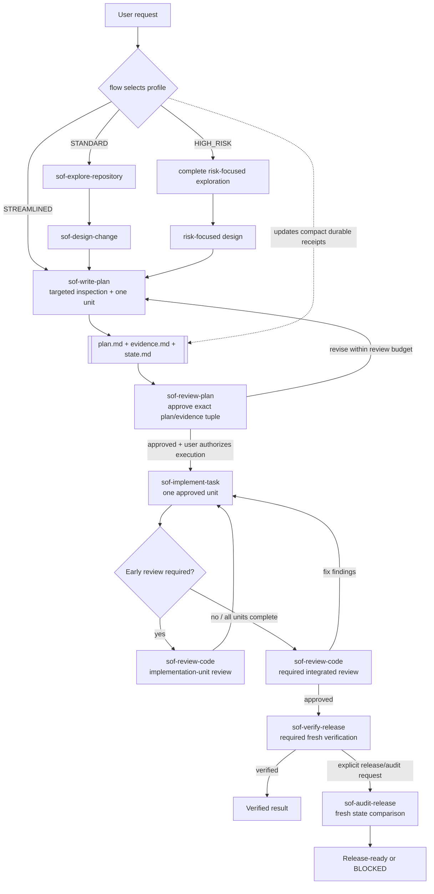

# Simple OpenCode Flow (SOF) Agents

A native OpenCode Markdown agent distribution for evidence-based planning, gated implementation, independent review, and release audit. Installed via `scripts/install.mjs` with zero external dependencies.

The canonical distribution source is the `agents/` directory in this repository. The `.opencode/` directory is a local OpenCode work directory, not the distribution source.

## Workflow



Every plan directory contains two authoritative artifacts and one compact workflow-state artifact:

```text
.opencode/plans/YYYY-MM-DD-<slug>/
├── plan.md
├── evidence.md
└── state.md
```

- `plan.md` and its revision are the sole execution authority.
- `evidence.md` is the repository-evidence and Source Access Integrity authority.
- `state.md` records the workflow profile, current phase, approval/review/verification receipts, blocker, and next gate. It is not execution or evidence authority and is not part of the plan/evidence approval hash tuple.
- Flow's expected updates to the active `state.md` are excluded from implementation-scope and post-verification comparisons only for that exact workflow-metadata file; every other unexplained change still blocks.

## Workflow Profiles

| Profile | Use when | Planning route | Early implementation-unit review |
| --- | --- | --- | --- |
| `STREAMLINED` | One clear low-risk unit with known scope and no material unknowns or shared/high-risk behavior | `sof-write-plan` performs targeted inspection, then independent plan review | None; integrated review is still required |
| `STANDARD` | Normal changes that do not qualify as Streamlined or High Risk | Repository exploration, design, plan writing, and plan review | Required only when evidence or dependencies justify it |
| `HIGH_RISK` | Security, privacy, permissions, migrations, irreversible operations, public/shared contracts, dependencies, data formats, or material unknowns | Complete risk-focused planning route | Required for every risk-related or dependency-foundational unit |

When Streamlined planning discovers ambiguity or risk, it escalates before creating artifacts. Independent plan review, integrated code review, and release verification are mandatory for every profile.

If execution reveals facts that invalidate the current profile, Flow stops execution, revises the profile in all three artifacts, and requires a new plan/evidence approval tuple before continuing.

## Core Invariants

- **Evidence before decision**: collect sufficient evidence before designing, planning, or implementing work that depends on external knowledge, data or interface structure, statistical or engineering assumptions, dependency behavior, or domain-specific methods.
- **Source access integrity**: a URL, citation, path, package, skill, or reference title is not evidence unless the relevant content was actually accessed and read.
- **Approval before execution**: implementation requires independent approval of the exact plan/evidence path, revision, and SHA-256 tuple.
- **Minimum sufficient complexity**: evidence, validation, artifacts, dependencies, abstractions, and review steps must be sufficient for the approved scope, not exhaustive by default.
- **Durable compact receipts**: Flow persists only downstream-required workflow state in sibling `state.md`; recoverable artifact content and historical transcripts are not copied into handoffs.
- **Bounded automatic review**: each plan-review loop allows three attempts, and material-basis restarts still count toward a maximum of five automatic plan-review calls per user-authorized review cycle.
- **User-locked mechanisms and artifacts**: when the user explicitly names a delivery mechanism or artifact, agents preserve it as a locked constraint. Infeasible choices block with an explanation; potentially better alternatives are presented for user decision and are never adopted silently.
- **On-demand external context**: agents load skills and authoritative web sources only to resolve a concrete, material information or evidence gap, not routinely or for completeness.
- **Independent repository-state review**: code review and release audit use read-only Git commands to establish actual scope instead of trusting implementer reports alone.
- **Pure orchestration**: Flow may read minimum necessary context to route work and construct handoffs, but every substantive answer, analysis, synthesis, and specialized-gate result comes from a subagent. Flow reports only orchestration status and permitted blockers itself.
- **Delegation-first capability reasoning**: Flow resolves required capabilities through authorized agents before reporting a capability gap; Flow's own missing tools are expected and never sufficient reason to stop.
- **No early return with a callable gate**: when the workflow has a callable next gate, Flow updates progress and delegates it before responding to the user.

## Capabilities And Native Fallback

All custom agents may load any installed skill. A skill supplies instructions and routing context; it never overrides the agent's actual Web, LSP, Bash, edit, Task, MCP/custom-tool, or external-directory permissions.

| Agent | Web | LSP | MCP/custom tools |
| --- | --- | --- | --- |
| `flow` | deny | deny | deny |
| `sof-research-source` | allow | deny | deny |
| `sof-explore-repository` | deny | allow | deny |
| `sof-design-change` | deny | allow | deny |
| `sof-write-plan` | deny | deny | deny |
| `sof-review-plan` | deny | deny | deny |
| `sof-implement-task` | allow | allow | allow |
| `sof-review-code` | deny | allow | deny |
| `sof-verify-release` | deny | deny | deny |
| `sof-audit-release` | deny | deny | deny |

Configured MCP servers and custom tools are trusted Build-level capabilities available only to `sof-implement-task` among custom agents. They remain constrained by the approved implementation unit and may not be used to expand scope, perform release actions, or create unapproved local or external side effects.

When a custom agent cannot continue within its permissions, it returns a compact `CAPABILITY_GAP` handoff. Flow routes local read-only gaps to native `explore`, external source questions to `sof-research-source`, dependency-source research to native `scout` when available, and remaining pre-gate MCP/custom-tool gaps to native `general`. If `scout` is unavailable, Flow uses `general`.

Native fallback output is input only: the responsible SOF agent must validate and incorporate it, and it can never serve directly as plan approval, code approval, verification, or audit receipt. Native `general` never replaces a formal SOF gate and cannot perform or repair work after execution approval or during code review, verification, or audit.

Flow distinguishes three questions before reporting a limitation:

- **Capability**: does an available tool or agent provide the required operation?
- **Authorization**: may that role perform the operation in the current gate and scope?
- **Availability**: can the authorized role currently be invoked?

Flow first resolves the responsible focused agent, then an allowed fallback where permitted. It reports `BLOCKED` only when no authorized and available delegate exists, a mandatory gate forbids delegation, or user/permission input is required. Flow never treats its own missing tool as sufficient evidence that the workflow lacks the capability.

For substantive work, Flow checks whether it can invoke the responsible delegate through Task; it does not inventory its own specialized tools to decide whether the requested outcome is possible.

A blocked report identifies the required capability, delegates considered, and the concrete authorization or availability blocker. It does not report Flow's personal tool limitations.

## Information Routing

Flow is a pure orchestrator and context manager. It may read the minimum repository context needed to classify a request, choose an agent, construct a self-contained handoff, validate a receipt, or recover workflow state. It never uses that read access to answer or perform specialized work itself.

Informational requests are delegated by capability:

Every delegated informational task is focused and non-mutating.

| Request | Default route |
| --- | --- |
| Precise local read-only search, symbol location, or narrow lookup | native `explore` |
| Cross-file explanation, general local question, or repository analysis | native `general` |
| Authoritative external documentation, standards, or a named URL | `sof-research-source` |
| Dependency source, managed cache, or upstream implementation research | native `scout`, otherwise `general` |
| Multi-source question | focused agents, then native `general` for synthesis |

Flow may relay one complete subagent answer with light formatting. It delegates substantive synthesis to `general`. A mixed request containing any change, plan, execution, review, or verification intent always enters the workflow route.

## State And Todo

- `state.md` is the durable workflow-navigation and gate-receipt authority.
- Flow's global Todo is the user-visible current-session projection of workflow gates.
- Each `sof-*` subagent may maintain a local Todo for its own multi-step invocation.
- Local Todo never carries state between agents; structured receipts and authoritative artifacts do.
- Flow rebuilds global Todo from `state.md` after context recovery and synchronizes it before every permitted workflow response.

| Current state or input | Required Flow action | May respond to user |
| --- | --- | --- |
| New informational request | Delegate to the best-fit answer agent; use `general` for required synthesis | After delegated answer completes |
| New workflow or mixed request | Create Todo, select profile, invoke first planning gate | No |
| Requested outcome requires a specialized capability | Resolve and invoke the authorized responsible agent | No |
| Callable next gate | Update Todo and invoke it immediately | No |
| `CAPABILITY_GAP` | Route fallback and resume original gate | Only if unresolved |
| Plan `CHANGES_REQUESTED` | Delegate revision to `sof-write-plan`, then rerun review | No |
| Plan `APPROVED` | Persist receipt and await explicit execution approval | Yes |
| Approved execution with incomplete work | Continue implementation and required reviews | No |
| All implementation units complete | Invoke integrated `sof-review-code` | No |
| Integrated review approved | Invoke release verification | No |
| `VERIFIED` | Complete Todo and return verified result | Yes |
| `BLOCKED`, permission request, or owner decision | Persist blocker and block active Todo | Yes |
| Explicit audit request | Invoke audit after verification | After audit completes |

## Terminology

- **Subagent invocation**: one focused-agent call made by `flow`.
- **Capability gap**: a compact request for one missing tool capability that preserves the responsible SOF gate.
- **Implementation unit**: one executable item in the approved `plan.md`.
- **Implementation-unit review**: early independent code review of one completed implementation unit when evidence requires it.
- **Integrated review**: independent review of the complete implemented change after all implementation units finish.
- **Review cycle**: a user-authorized automatic plan-review budget containing at most five review calls.
- **Trusted executor**: an agent with broad capabilities whose authorization remains limited by the approved plan and behavioral contract.

## Agents

| Agent | Role |
| --- | --- |
| `flow` | Pure orchestrator and context manager for request routing, handoffs, global Todo, gates, and compact `state.md` receipts |
| `sof-research-source` | Read authoritative external sources for standalone questions or concrete planning evidence gaps |
| `sof-explore-repository` | Collect compact repository evidence for Standard and High Risk planning |
| `sof-design-change` | Define the smallest evidence-backed Standard or High Risk design |
| `sof-write-plan` | Create or revise planning artifacts and initialize `state.md` |
| `sof-review-plan` | Independently review and approve exact plan/evidence revisions |
| `sof-implement-task` | Trusted Build-level executor for one approved implementation unit |
| `sof-review-code` | Independently inspect actual repository changes and perform unit or integrated review |
| `sof-verify-release` | Trusted verification executor that runs only approved release commands |
| `sof-audit-release` | Audit an explicit release action using receipts and fresh repository state |

## Install

Install agents using the zero-dependency `scripts/install.mjs` installer:

```bash
# Project-level install (copies agents to .opencode/agents/)
node scripts/install.mjs --scope project

# Global install (copies agents to ~/.config/opencode/agents/)
node scripts/install.mjs --scope global

# Dry-run (preview without changes)
node scripts/install.mjs --dry-run

# Custom project directory install (creates .opencode/agents/ at target; patches or creates opencode.json)
node scripts/install.mjs --target ./my-project
```

The installer:
- Copies all agent `.md` files from `agents/` to the target directory
- Patches or creates `opencode.json` with required permission deny entries (project and target scope only)
- Detects JSONC configuration and exits with error (JSONC is not supported)
- Preserves existing files in the target directory

### Manual Installation

If you cannot or prefer not to run the installer script:

1. **Copy agent files** from `agents/` to your OpenCode agents directory:
   - **Project-level:** `<project>/.opencode/agents/`
   - **Global:** `~/.config/opencode/agents/`
   - **Custom:** `<custom-project>/.opencode/agents/` (use `--target <path>` for automated install)

2. **(Optional) Configure deny entries** in your project's `opencode.json`:
   ```json
   {
     "agent": {
       "build": {
         "permission": {
           "task": {
             "sof-*": "deny",
             "flow": "deny"
           }
         }
       },
       "plan": {
         "permission": {
           "task": {
             "sof-*": "deny",
             "flow": "deny"
           }
         }
       }
     }
   }
   ```
   The installer handles this automatically for project and target installs.

**Note**: The `agents/` directory in this repository is the canonical distribution source. The `.opencode/` directory is a local OpenCode work directory and should not be used for distribution.

## Use

Select the `flow` primary agent in OpenCode, then describe the goal and constraints:

```text
Create a reviewed implementation plan for <goal>. Plan only; do not execute.
```

After `sof-review-plan` approves the exact plan/evidence tuple, explicitly authorize execution:

```text
Approve execution of the current approved plan.
```

Within the same session, `flow` distinguishes:

- **Continue current plan**: resume the approved execution.
- **Revise current plan**: update the same plan directory and review again.
- **Create follow-up plan**: create and independently approve a new plan.

Flow automatically selects `STREAMLINED`, `STANDARD`, or `HIGH_RISK`, records the choice in `state.md`, projects the active route into global Todo, and restores interrupted workflows from the three sibling artifacts. It may read minimum necessary context for routing and handoff integrity, edits only the active plan's `state.md`, and never runs shell commands or performs a subagent's substantive work.

For ordinary factual or documentation questions, Flow does not start a planning workflow. It delegates local questions to the best-fit native subagent, external authoritative questions to `sof-research-source`, and multi-source synthesis to `general`. External research is never routed to the local-only repository explorer.

`sof-implement-task` intentionally has broad Build-level capabilities, including configured MCP/custom tools. `sof-verify-release` has broad Bash capability but no Web, LSP, or MCP/custom-tool access. Their approved contracts limit what they may do. No custom agent commits, pushes, publishes, or performs a release action.
