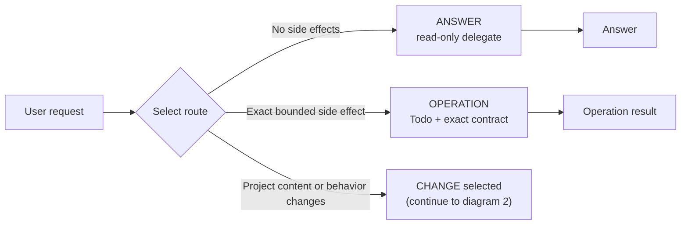
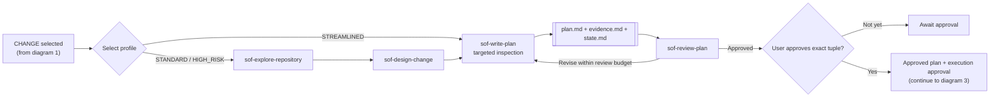
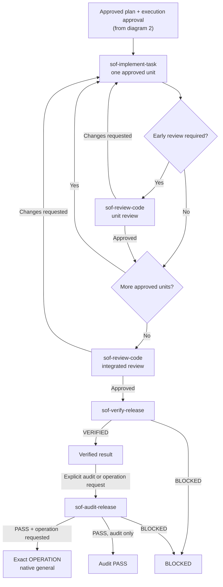

# Simple OpenCode Flow (SOF) Agents

Simple OpenCode Flow is a native OpenCode Markdown agent distribution built around a restricted `flow` orchestrator. Flow delegates questions and bounded operations to the smallest sufficient agent set, while project changes use evidence-based planning, exact approval, independent review, and fresh verification.

Use Flow when you want one entry point that can answer questions, perform explicit repository operations, or safely coordinate a reviewed change without allowing a general-purpose agent to bypass formal gates.

## Install

Install the agents globally or into another project:

```bash
# Global install
node scripts/install.mjs --scope global

# Install into another project
node scripts/install.mjs --target ./my-project
```

Other installation scopes and manual setup are documented in [Additional Installation Options](#additional-installation-options).

## Use

In OpenCode, select the `flow` primary agent, then describe the result you want. Flow classifies the request as `ANSWER`, `OPERATION`, or `CHANGE`.

### Ask Or Inspect

Questions and read-only investigation use the `ANSWER` route. Flow delegates to the most suitable read-only agent without starting a planning workflow.

```text
Explain how authentication configuration is loaded and identify the relevant files.
```

### Perform A Bounded Operation

Explicit side effects that do not modify project content use the `OPERATION` route. Flow creates a Todo and gives native `general` an exact operation contract.

```text
Check the current repository state, commit the existing changes, then push.
```

If the operation discovers that source, configuration, documentation, dependencies, or project behavior must change, it stops and is reclassified as `CHANGE`.

### Make A Project Change

Any project-content or behavior modification uses the gated `CHANGE` workflow.

```text
Update the retry configuration documentation and implementation, then verify the change.
```

Flow plans and independently reviews the exact change first. After plan approval, explicitly authorize execution:

```text
Approve execution of the current approved plan.
```

## How Flow Routes Work

| Route | Use when | Default behavior |
| --- | --- | --- |
| `ANSWER` | Questions, searches, explanations, or research with no side effects | Delegate the minimum sufficient read-only agent set |
| `OPERATION` | An explicitly requested bounded side effect that does not modify project content or behavior | Create Todo and delegate an exact Operation Contract to native `general` |
| `CHANGE` | Any source, configuration, documentation, dependency, design, behavior, or validation-strategy modification | Run the gated SOF workflow |

Flow prefers one sufficient delegate. It uses multiple agents only when capabilities, independence, or risk require them. An active `CHANGE` workflow takes precedence over new operations, and a verified change is audited before a requested release operation is executed.

### 1. Request Routing

This first view selects the route. The `CHANGE selected` boundary continues in the next diagram.



## Safety Principles

- **Evidence before decisions**: collect sufficient evidence before choosing a direction.
- **Read sources before citing them**: a path, URL, title, package, skill, or reference is not evidence until relevant content was accessed.
- **Minimum sufficient complexity**: use the fewest agents, artifacts, gates, and checks sufficient for the request and risk.
- **Exact approval before execution**: a `CHANGE` requires an approved exact plan/evidence tuple and explicit user approval; an `OPERATION` executes only its explicitly approved exact targets and effects.

Flow's user-visible safety boundaries:

- Formal design, planning, implementation, review, verification, and audit gates always use their responsible `sof-*` agent. Native agents cannot replace them.
- An Operation Contract defines exact targets and effects, prohibited project-content changes, prechecks, success evidence, and stop conditions.
- `OPERATION`, `CHANGE`, and multi-agent `ANSWER` routes maintain global Todo progress. Each `sof-*` agent may also maintain a local Todo for its own work.
- Flow reads only enough context to route work, construct handoffs, validate receipts, and recover state. It does not turn those reads into its own answers or formal-gate conclusions.
- Flow resolves capability, authorization, and availability through delegates. Flow's own missing specialized tools are not workflow blockers.

## CHANGE Workflow Details

Every `CHANGE` uses a profile matched to its scope and risk:

| Profile | Use when | Planning behavior | Early implementation-unit review |
| --- | --- | --- | --- |
| `STREAMLINED` | One clear low-risk unit with known scope and no material unknowns or shared/high-risk behavior | Targeted inspection and plan writing | None; integrated review is still required |
| `STANDARD` | Normal changes that do not qualify as Streamlined or High Risk | Repository exploration, design, plan writing, and plan review | Required when evidence or dependencies justify it |
| `HIGH_RISK` | Security, privacy, permissions, migrations, irreversible operations, public/shared contracts, dependencies, data formats, or material unknowns | Complete risk-focused planning route | Required for every risk-related or dependency-foundational unit |

When Streamlined planning discovers ambiguity or risk, it escalates before creating artifacts. If execution invalidates the current profile, Flow stops, revises the artifacts, and requires approval of a new exact tuple.

### 2. Plan And Approve

This view begins at `CHANGE selected` from diagram 1 and ends at the execution boundary used by diagram 3.



### 3. Execute And Verify

This view continues from the approved execution boundary in diagram 2. A requested post-verification operation is audited before native `general` receives its exact Operation Contract.



### Workflow Artifacts

Every plan directory contains two authoritative artifacts and one compact workflow-state artifact:

```text
.opencode/plans/YYYY-MM-DD-<slug>/
|-- plan.md
|-- evidence.md
`-- state.md
```

- `plan.md` and its revision are the sole execution authority.
- `evidence.md` is the repository-evidence and source-access authority.
- `state.md` records the profile, current phase, approval/review/verification receipts, blocker, and next gate. It is not execution or evidence authority and is not part of the approval hash tuple.
- Only Flow's expected updates to the active `state.md` are excluded from implementation-scope and post-verification comparisons. Every other unexplained change blocks.

Within the same session, Flow distinguishes continuing the current approved plan, revising it and invalidating approval, and creating a separately reviewed follow-up plan.

## Reference

### Agents

| Agent | Role |
| --- | --- |
| `flow` | Restricted orchestrator and context manager for routing, handoffs, global Todo, gates, and compact `state.md` receipts |
| `sof-research-source` | Read authoritative external sources for standalone questions or concrete planning evidence gaps |
| `sof-explore-repository` | Collect compact repository evidence for Standard and High Risk planning |
| `sof-design-change` | Define the smallest evidence-backed Standard or High Risk design |
| `sof-write-plan` | Create or revise planning artifacts and initialize `state.md` |
| `sof-review-plan` | Independently review and approve exact plan/evidence revisions |
| `sof-implement-task` | Execute one unit from an independently approved plan |
| `sof-review-code` | Independently inspect actual repository changes and perform unit or integrated review |
| `sof-verify-release` | Run approved verification commands without implementing or repairing work |
| `sof-audit-release` | Audit an explicit post-verification operation using receipts and fresh repository state |

Native `general` has three roles: `ANSWER` explanation or synthesis, exact `OPERATION` execution, and permitted focused fallback before a formal gate. It never replaces formal design, planning, implementation, review, verification, or audit.

### Terminology

- **Subagent invocation**: one focused-agent call made by Flow.
- **Capability gap**: one missing tool capability that preserves the responsible SOF gate.
- **Implementation unit**: one executable item in the approved `plan.md`.
- **Implementation-unit review**: early independent code review of one completed unit when evidence requires it.
- **Integrated review**: independent review of the complete implemented change.
- **Review cycle**: a user-authorized automatic plan-review budget containing at most five review calls.

### Additional Installation Options

The zero-dependency installer copies agents from the canonical `agents/` distribution directory:

```bash
# Project-level install
node scripts/install.mjs --scope project

# Global install
node scripts/install.mjs --scope global

# Install into another project
node scripts/install.mjs --target ./my-project

# Preview without changes
node scripts/install.mjs --dry-run
```

Project and target installs patch or create `opencode.json` with deny entries that prevent native `build` and `plan` agents from invoking Flow or `sof-*` agents directly. The installer rejects JSONC configuration and preserves unrelated existing configuration.

#### Manual Installation

Copy the files from `agents/` to the desired OpenCode agents directory:

- Project: `<project>/.opencode/agents/`
- Global: `~/.config/opencode/agents/`
- Custom project: `<custom-project>/.opencode/agents/`

For project installations, optionally add the same invocation boundary manually:

```json
{
  "agent": {
    "build": {
      "permission": {
        "task": {
          "sof-*": "deny",
          "flow": "deny"
        }
      }
    },
    "plan": {
      "permission": {
        "task": {
          "sof-*": "deny",
          "flow": "deny"
        }
      }
    }
  }
}
```

The `.opencode/` directory in this repository is a local OpenCode work directory, not the distribution source.
