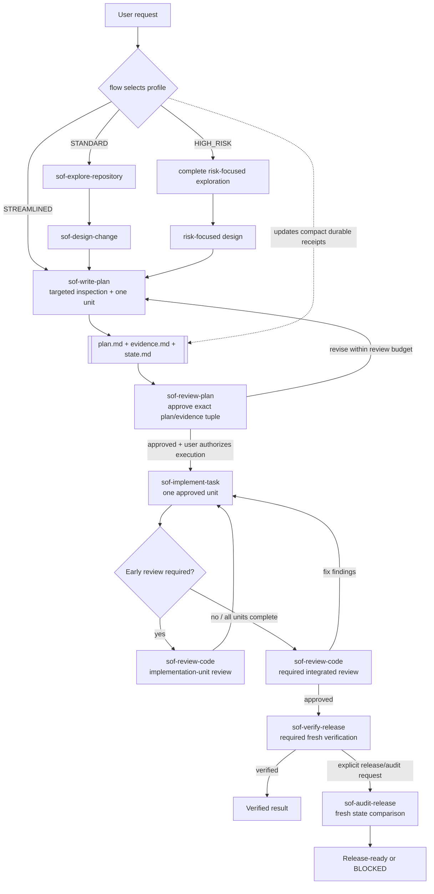

# Simple OpenCode Flow (SOF) Agents

A native OpenCode Markdown agent distribution for evidence-based planning, gated implementation, independent review, and release audit. Installed via `scripts/install.mjs` with zero external dependencies.

The canonical distribution source is the `agents/` directory in this repository. The `.opencode/` directory is a local OpenCode work directory, not the distribution source.

## Route Model

Flow is a restricted orchestrator. It reads only enough context to route work, construct handoffs, validate receipts, and recover state; substantive work is delegated.

| Route | Use when | Default behavior |
| --- | --- | --- |
| `ANSWER` | No side effects: questions, searches, explanations, or research | Delegate the minimum sufficient read-only agent set |
| `OPERATION` | An explicit bounded side effect that does not modify project content or behavior | Create Todo and delegate an exact Operation Contract to native `general` |
| `CHANGE` | Any source, configuration, documentation, dependency, design, behavior, or validation-strategy modification | Run the gated SOF workflow |

An active `CHANGE` workflow takes precedence. A verified change followed by an operation is audited before Flow delegates the exact operation.

## CHANGE Workflow



Every plan directory contains two authoritative artifacts and one compact workflow-state artifact:

```text
.opencode/plans/YYYY-MM-DD-<slug>/
├── plan.md
├── evidence.md
└── state.md
```

- `plan.md` and its revision are the sole execution authority.
- `evidence.md` is the repository-evidence and Source Access Integrity authority.
- `state.md` records the workflow profile, current phase, approval/review/verification receipts, blocker, and next gate. It is not execution or evidence authority and is not part of the plan/evidence approval hash tuple.
- Flow's expected updates to the active `state.md` are excluded from implementation-scope and post-verification comparisons only for that exact workflow-metadata file; every other unexplained change still blocks.

## Workflow Profiles

| Profile | Use when | Planning route | Early implementation-unit review |
| --- | --- | --- | --- |
| `STREAMLINED` | One clear low-risk unit with known scope and no material unknowns or shared/high-risk behavior | `sof-write-plan` performs targeted inspection, then independent plan review | None; integrated review is still required |
| `STANDARD` | Normal changes that do not qualify as Streamlined or High Risk | Repository exploration, design, plan writing, and plan review | Required only when evidence or dependencies justify it |
| `HIGH_RISK` | Security, privacy, permissions, migrations, irreversible operations, public/shared contracts, dependencies, data formats, or material unknowns | Complete risk-focused planning route | Required for every risk-related or dependency-foundational unit |

When Streamlined planning discovers ambiguity or risk, it escalates before creating artifacts. Independent plan review, integrated code review, and release verification are mandatory for every profile.

If execution reveals facts that invalidate the current profile, Flow stops execution, revises the profile in all three artifacts, and requires a new plan/evidence approval tuple before continuing.

## Core Invariants

- **Evidence before decisions**: collect sufficient evidence before choosing a direction.
- **Read sources before citing them**: a path, URL, title, package, skill, or reference is not evidence until relevant content was accessed.
- **Minimum sufficient complexity**: use the fewest agents, artifacts, dependencies, gates, and checks sufficient for the request and risk.
- **Exact approval before execution**: a `CHANGE` requires an approved exact plan/evidence tuple and explicit user approval; an `OPERATION` executes only its explicitly approved exact targets and effects.

## Routing And Safety

- Formal design, planning, implementation, review, verification, and audit gates always use their responsible `sof-*` agent. Native agents never replace a formal gate.
- Native `general` is used only for `ANSWER` explanation/synthesis, an exact `OPERATION` contract, or a permitted focused pre-gate fallback.
- An Operation Contract names exact targets/effects, prohibited project-content changes, prechecks, success evidence, and stop conditions. Discovery of a required content change reclassifies the request as `CHANGE`.
- `OPERATION`, `CHANGE`, and multi-agent `ANSWER` routes create global Todo before their first Task. Each `sof-*` agent may use local Todo, but structured receipts carry state between agents.
- Flow resolves capability, authorization, and availability through delegates; Flow's personal tool limitations are not workflow blockers.
- Skills and broad executor capabilities never expand approved scope. Fallback results are input only until the responsible formal agent incorporates them.

## Terminology

- **Subagent invocation**: one focused-agent call made by `flow`.
- **Capability gap**: a compact request for one missing tool capability that preserves the responsible SOF gate.
- **Implementation unit**: one executable item in the approved `plan.md`.
- **Implementation-unit review**: early independent code review of one completed implementation unit when evidence requires it.
- **Integrated review**: independent review of the complete implemented change after all implementation units finish.
- **Review cycle**: a user-authorized automatic plan-review budget containing at most five review calls.
- **Trusted executor**: an agent with broad capabilities whose authorization remains limited by the approved plan and behavioral contract.

## Agents

| Agent | Role |
| --- | --- |
| `flow` | Pure orchestrator and context manager for request routing, handoffs, global Todo, gates, and compact `state.md` receipts |
| `sof-research-source` | Read authoritative external sources for standalone questions or concrete planning evidence gaps |
| `sof-explore-repository` | Collect compact repository evidence for Standard and High Risk planning |
| `sof-design-change` | Define the smallest evidence-backed Standard or High Risk design |
| `sof-write-plan` | Create or revise planning artifacts and initialize `state.md` |
| `sof-review-plan` | Independently review and approve exact plan/evidence revisions |
| `sof-implement-task` | Trusted Build-level executor for one approved implementation unit |
| `sof-review-code` | Independently inspect actual repository changes and perform unit or integrated review |
| `sof-verify-release` | Trusted verification executor that runs only approved release commands |
| `sof-audit-release` | Audit an explicit release action using receipts and fresh repository state |

## Install

Install agents using the zero-dependency `scripts/install.mjs` installer:

```bash
# Project-level install (copies agents to .opencode/agents/)
node scripts/install.mjs --scope project

# Global install (copies agents to ~/.config/opencode/agents/)
node scripts/install.mjs --scope global

# Dry-run (preview without changes)
node scripts/install.mjs --dry-run

# Custom project directory install (creates .opencode/agents/ at target; patches or creates opencode.json)
node scripts/install.mjs --target ./my-project
```

The installer:
- Copies all agent `.md` files from `agents/` to the target directory
- Patches or creates `opencode.json` with required permission deny entries (project and target scope only)
- Detects JSONC configuration and exits with error (JSONC is not supported)
- Preserves existing files in the target directory

### Manual Installation

If you cannot or prefer not to run the installer script:

1. **Copy agent files** from `agents/` to your OpenCode agents directory:
   - **Project-level:** `<project>/.opencode/agents/`
   - **Global:** `~/.config/opencode/agents/`
   - **Custom:** `<custom-project>/.opencode/agents/` (use `--target <path>` for automated install)

2. **(Optional) Configure deny entries** in your project's `opencode.json`:
   ```json
   {
     "agent": {
       "build": {
         "permission": {
           "task": {
             "sof-*": "deny",
             "flow": "deny"
           }
         }
       },
       "plan": {
         "permission": {
           "task": {
             "sof-*": "deny",
             "flow": "deny"
           }
         }
       }
     }
   }
   ```
   The installer handles this automatically for project and target installs.

**Note**: The `agents/` directory in this repository is the canonical distribution source. The `.opencode/` directory is a local OpenCode work directory and should not be used for distribution.

## Use

Select the `flow` primary agent in OpenCode, then describe the goal and constraints:

```text
Create a reviewed implementation plan for <goal>. Plan only; do not execute.
```

After `sof-review-plan` approves the exact plan/evidence tuple, explicitly authorize execution:

```text
Approve execution of the current approved plan.
```

Within the same session, `flow` distinguishes:

- **Continue current plan**: resume the approved execution.
- **Revise current plan**: update the same plan directory and review again.
- **Create follow-up plan**: create and independently approve a new plan.

Flow classifies each request as `ANSWER`, `OPERATION`, or `CHANGE`. It delegates read-only answers to the best-fit agent, delegates exact bounded operations to native `general`, and selects `STREAMLINED`, `STANDARD`, or `HIGH_RISK` only for changes.

For `CHANGE`, Flow records the profile in `state.md`, projects the active route into global Todo, and restores interrupted work from the three sibling artifacts. It may read minimum necessary context for routing and handoff integrity, edits only the active plan's `state.md`, and never performs a delegate's substantive work.

`sof-implement-task` intentionally has broad Build-level capabilities, including configured MCP/custom tools. `sof-verify-release` has broad Bash capability but no Web, LSP, or MCP/custom-tool access. Their approved contracts limit what they may do. Custom agents do not commit, push, publish, or perform release actions; after required verification and audit, native `general` may perform only the exact approved `OPERATION`.
