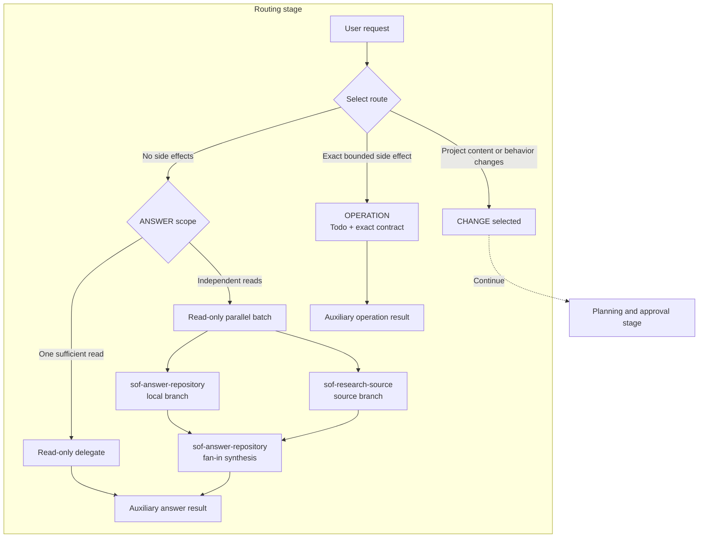
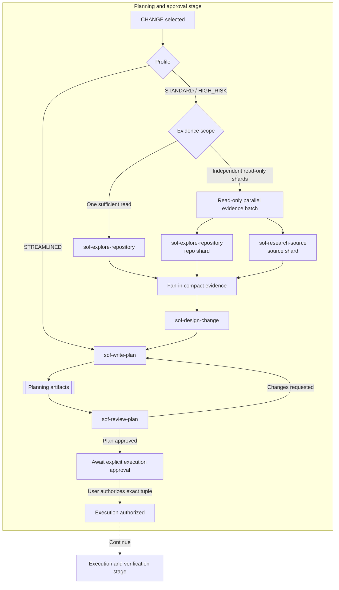
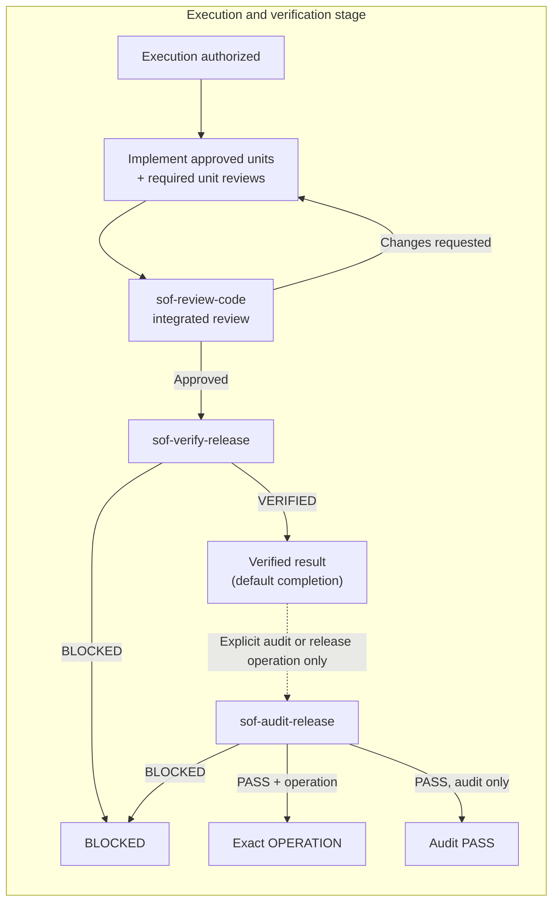

# Simple OpenCode Flow (SOF) Agents

Simple OpenCode Flow is a native OpenCode Markdown agent distribution built around a restricted `flow` orchestrator. Flow routes questions and bounded operations to SOF auxiliary agents, fans out independent read-only investigation when safe, and uses evidence-based planning, exact approval, independent review, and fresh verification for project changes.

Use Flow when you want one entry point that can route answers, explicit repository operations, or safely coordinate a reviewed change without allowing a general-purpose agent to bypass formal gates.

## Install

Install the agents globally or into another project:

```bash
# Global install
node scripts/install.mjs --scope global

# Install into another project
node scripts/install.mjs --target ./my-project
```

Other installation scopes and manual setup are documented in [Additional Installation Options](#additional-installation-options).

## Use

In OpenCode, select the `flow` primary agent, then describe the result you want. Flow classifies the request as `ANSWER`, `OPERATION`, or `CHANGE`.

### Ask Or Inspect

Questions and read-only investigation use the `ANSWER` route. Flow delegates to `sof-answer-repository` for local repository answers or `sof-research-source` for authoritative external sources without starting a planning workflow. When local and external reads are independent, Flow may run them as a read-only parallel batch and then synthesize the compact results.

```text
Explain how authentication configuration is loaded and identify the relevant files.
```

### Perform A Bounded Operation

Explicit side effects that do not modify project content use the `OPERATION` route. Flow creates a Todo and gives `sof-execute-operation` an exact operation contract.

```text
Check the current repository state, commit the existing changes, then push.
```

If the operation discovers that source, configuration, documentation, dependencies, or project behavior must change, it stops and is reclassified as `CHANGE`.

### Make A Project Change

Any project-content or behavior modification uses the gated `CHANGE` workflow.

```text
Update the retry configuration documentation and implementation, then verify the change.
```

Flow plans and independently reviews the exact change first. After plan approval, explicitly authorize execution:

```text
Approve execution of the current approved plan.
```

### Support Document Registry

The Support Document Registry is an extensible YAML metadata file that lists available support documents. Flow reads its metadata once at the start of every top-level request, but never reads document bodies automatically. Support documents are optional, non-authoritative references that never override workflow rules, routing, artifacts, or approvals.

## How Flow Routes Work

| Route | Use when | Default behavior |
| --- | --- | --- |
| `ANSWER` | Questions, searches, explanations, or research with no side effects | Delegate to `sof-answer-repository` or `sof-research-source`; use a read-only parallel batch for independent multi-source reads |
| `OPERATION` | An explicitly requested bounded side effect that does not modify project content or behavior | Create Todo and delegate an exact Operation Contract to `sof-execute-operation` |
| `CHANGE` | Any source, configuration, documentation, dependency, design, behavior, or validation-strategy modification | Run the gated SOF workflow |

Flow prefers one sufficient SOF delegate. It uses multiple agents only when capabilities, independence, or risk require them. Read-only parallel batches are limited to independent no-side-effect reads and must fan in to compact synthesis before any downstream handoff. The auxiliary answer and operation agents are not formal `CHANGE` workflow gates. An active `CHANGE` workflow takes precedence over new operations, and a verified change is audited before a requested release operation is executed.

### Request Routing

This stage selects the route. The `CHANGE selected` boundary continues into planning and approval.



## Safety Principles

- **Evidence before decisions**: collect sufficient evidence before choosing a direction.
- **Read sources before citing them**: a path, URL, title, package, skill, or reference is not evidence until relevant content was accessed.
- **Minimum sufficient complexity**: use the fewest agents, artifacts, gates, and checks sufficient for the request and risk.
- **Exact approval before execution**: a `CHANGE` requires an approved exact plan/evidence tuple and explicit user approval; an `OPERATION` executes only its explicitly approved exact targets and effects.
- **Controlled read-only parallelism**: independent read-only branches may run in parallel only when Flow can fan them in to one compact, traceable context before the next handoff.
- **I/O discipline**: narrow reads with Evidence IDs, changed-file lists, paths, and Repository Access Index entries before opening more files or passing larger handoffs.

Flow's user-visible safety boundaries:

- Formal design, planning, implementation, review, verification, and audit gates always use their responsible `sof-*` agent. Native agents cannot replace them.
- `sof-answer-repository` and `sof-execute-operation` are auxiliary agents for `ANSWER` and `OPERATION`; they do not create planning artifacts or enter the gated `CHANGE` workflow.
- An Operation Contract defines exact targets and effects, prohibited project-content changes, prechecks, success evidence, and stop conditions.
- `OPERATION`, `CHANGE`, and multi-agent `ANSWER` routes maintain global Todo progress. Each `sof-*` agent may also maintain a local Todo for its own work.
- Read-only parallel batches may use only `sof-answer-repository`, `sof-research-source`, or `sof-explore-repository`; they never parallelize implementation, review, verification, audit, artifact writes, or `state.md` updates.
- Plans include a Repository Access Index so implementers and reviewers can start from required authority sections, required repository files, optional follow-up files, prohibited scope expansion, expected changed files, verification commands, and protected paths without broad rediscovery.
- Flow reads only enough context to route work, construct handoffs, validate receipts, recover state, and edit active current-workspace `.opencode/plans/*/state.md` receipts. It does not turn those reads into its own answers, operations, or formal-gate conclusions.
- Flow resolves capability, authorization, and availability through delegates. Flow's own missing specialized tools are not workflow blockers.

### Plugin Compatibility

SOF uses role-driven permissions rather than a global tool allowlist. Installed plugin, custom, and MCP tools inherit OpenCode and user configuration unless a SOF role explicitly restricts a known built-in or SOF-controlled capability.

Flow does not decide whether a plugin should be installed, enabled, allowed, or trusted. If a tool is exposed by the runtime, the responsible SOF agent may use it when the action fits that agent's role, the selected route, and the active approval or operation contract.

Plugin availability does not change workflow authority. `plan.md`, `evidence.md`, `state.md`, route selection, approval tuples, review, verification, audit, stop conditions, and artifact locality rules remain binding. If a plugin has its own subagent, context, or permission settings, configure those in the plugin or OpenCode configuration rather than in Flow.

### File Mutation Permissions

OpenCode's built-in `edit`, `write`, and `apply_patch` tools all evaluate file changes through the `edit` permission in current releases. SOF nevertheless declares identical path rules for all three tool names. This explicit mirroring keeps agent intent visible and avoids compatibility ambiguity with plugins or runtimes that expose the tools independently.

OpenCode may report a current-workspace file either as `.opencode/plans/...` or with a workspace-relative prefix such as `Codex/project/.opencode/plans/...`, especially for non-Git directories represented by a global project. SOF planning-artifact rules therefore cover both:

- `.opencode/plans/*/<artifact>.md`
- `*/.opencode/plans/*/<artifact>.md`

These patterns do not expand workflow authority. Artifact locality, current-workspace checks, external-directory permissions, and each agent's role constraints remain binding.

| Agent role | File mutation authority |
| --- | --- |
| `flow` | Update an existing active `state.md` only; never initialize a missing state file |
| `sof-write-plan` | Create or revise `plan.md` and `evidence.md`, and initialize `state.md`, only in the active plan directory |
| `sof-implement-task` | Modify approved project files, but never `.opencode/plans/**` or SOF support files |
| `sof-execute-operation`, `sof-verify-release` | No file-tool writes; Bash does not authorize workflow-artifact creation or repair |
| Answer, research, exploration, design, review, and audit agents | Read-only |

Workflow artifacts may be written only by their responsible role. A writer permission failure is a `CAPABILITY_GAP` or `BLOCKED` result; Flow must not use `sof-execute-operation`, Bash, or another auxiliary agent as a write fallback.

## CHANGE Workflow Details

Every `CHANGE` uses a profile matched to its scope and risk:

| Profile | Use when | Planning behavior | Early implementation-unit review |
| --- | --- | --- | --- |
| `STREAMLINED` | One clear low-risk unit with known scope and no material unknowns or shared/high-risk behavior | Targeted inspection and plan writing | None; integrated review is still required |
| `STANDARD` | Normal changes that do not qualify as Streamlined or High Risk | Repository exploration, optional read-only evidence shards, design, plan writing, and plan review | Required when evidence or dependencies justify it |
| `HIGH_RISK` | Security, privacy, permissions, migrations, irreversible operations, public/shared contracts, dependencies, data formats, or material unknowns | Complete risk-focused planning route with optional read-only evidence shards | Required for every risk-related or dependency-foundational unit |

When Streamlined planning discovers ambiguity or risk, it escalates before creating artifacts. If execution invalidates the current profile, Flow stops, revises the artifacts, and requires approval of a new exact tuple.

### Plan And Approve

This stage begins at `CHANGE selected`, obtains plan approval, and waits for explicit execution authorization.



### Execute And Verify

This stage continues after execution authorization. Verification is required for every `CHANGE`; audit runs only after verification when the user explicitly requests audit or a release operation.



Each approved implementation unit uses a fresh `sof-implement-task` invocation in dependency order. Early unit review is added when the selected profile, evidence, dependencies, or new implementation findings require it. Each code-review scope starts with a complete attempt `1`; finding-only fixes receive focused follow-up review, while material-basis changes restart complete review at attempt `1`. Attempts are capped at three and total reviewer calls per scope at five. Implementation, review, verification, and audit are not parallelized.

### Workflow Artifacts

Every plan directory contains two authoritative artifacts and one compact workflow-state artifact:

```text
.opencode/plans/YYYY-MM-DD-<slug>/
|-- plan.md
|-- evidence.md
`-- state.md
```

- `plan.md` and its revision are the sole execution authority.
- `evidence.md` is the repository-evidence and source-access authority.
- `state.md` records the profile, current phase, approval/review/verification receipts, blocker, and next gate. It is not execution or evidence authority and is not part of the approval hash tuple.
- Flow-generated workflow artifacts are current-workspace relative and must stay under `.opencode/plans/YYYY-MM-DD-<slug>/`. This artifact-locality rule applies to `plan.md`, `evidence.md`, and `state.md`; it does not prohibit approved external-directory access for other non-artifact work.
- Only Flow's expected updates to the active `state.md` are excluded from implementation-scope and post-verification comparisons. Every other unexplained change blocks.

Within the same session, Flow distinguishes continuing the current approved plan, revising it and invalidating approval, and creating a separately reviewed follow-up plan.

## Reference

### Agents

| Agent | Role |
| --- | --- |
| `flow` | Restricted orchestrator and context manager for routing, handoffs, global Todo, gates, and compact `state.md` receipts |
| `sof-answer-repository` | Auxiliary read-only repository answerer and synthesis agent for `ANSWER`, including read-only parallel batch fan-in |
| `sof-execute-operation` | Auxiliary executor for exact non-project-content `OPERATION` contracts |
| `sof-research-source` | Read authoritative external sources for standalone questions or concrete planning evidence gaps, including focused parallel source branches |
| `sof-explore-repository` | Collect compact repository evidence for Standard and High Risk planning, including focused parallel evidence shards |
| `sof-design-change` | Define the smallest evidence-backed Standard or High Risk design |
| `sof-write-plan` | Create or revise planning artifacts and initialize `state.md` |
| `sof-review-plan` | Independently review and approve exact plan/evidence revisions |
| `sof-implement-task` | Execute one unit from an independently approved plan |
| `sof-review-code` | Independently inspect actual repository changes and perform unit or integrated review |
| `sof-verify-release` | Run approved verification commands without implementing or repairing work |
| `sof-audit-release` | Audit an explicit post-verification operation using receipts and fresh repository state |

Native fallback agents are not part of normal Flow routing. Any future native-agent escape hatch requires explicit user approval outside the default SOF route.

### Support Documents

Support documents are optional, read-only, non-authoritative references kept as separate Markdown files. Project and `--target` installs place them under `.opencode/sof-support/`; global installs place them under `~/.config/opencode/sof-support/`. When a project registry exists it fully shadows the global registry. Flow uses the global registry only when the project registry is absent, never merges registries, and never falls back globally from a broken project registry.

Flow reads the selected registry metadata once at the start of every top-level request, then hands exact matching support-document paths to subagents. Document bodies remain optional and are read only when relevant. A global-root permission does not authorize independent discovery, globbing, registry traversal, or consultation. Support documents are not agents, skills, commands, workflows, gates, or workflow authority, and they never override routing, artifacts, approved tuples, commands, approvals, verification, audit, stop conditions, or user instructions.

### Customizing the Support Document Registry

The registry lives at `.opencode/sof-support/registry.md` (project) or `~/.config/opencode/sof-support/registry.md` (global). A project registry fully shadows the global registry; registries are never merged and a broken project registry does not fall back to global.

The registry uses a simple YAML structure:

- `version` — registry format version (currently `1`)
- `documents` — an array of entries

Each entry has these required fields:

| Field | Description |
| --- | --- |
| `path` | Relative path to the support document under the support root |
| `type` | Document type (e.g., `lens`) |
| `purpose` | Short description of what the document provides |
| `routes` | Flow routes where the document may be relevant (e.g., `[CHANGE]`) |
| `authority` | Always `non-authoritative` for support documents |
| `auto_load` | Reserved metadata; it never causes Flow to read the document body automatically |

Optional fields include `stages` (pipeline stages), `agents` (target subagents), and `use_when` (conditional selectors). These selectors refine when a document is relevant without changing existing route-only entries.

To add a new support document, create the Markdown file under the support root and add a matching entry to the registry's `documents` array. Flow will discover it on the next top-level request.

### Terminology

- **Subagent invocation**: one focused-agent call made by Flow.
- **Read-only parallel batch**: a Flow-managed set of independent no-side-effect read branches with explicit branch IDs, scopes, expected receipts, and one fan-in synthesis before downstream handoff.
- **Evidence shard**: one focused read-only repository or source branch in a planning evidence batch, using Flow-assigned ID prefixes to avoid evidence collisions.
- **Repository Access Index**: a plan section mapping each unit to required authority sections, required repository files, optional follow-up files, prohibited scope expansion, expected changed files, verification commands, and protected paths.
- **Capability gap**: one missing tool capability that preserves the responsible SOF gate.
- **Implementation unit**: one executable item in the approved `plan.md`.
- **Implementation-unit review**: early independent code review of one completed unit when evidence requires it.
- **Integrated review**: independent review of the complete implemented change.
- **Review cycle**: a user-authorized automatic plan-review budget containing at most five review calls.

### Additional Installation Options

The zero-dependency installer copies agents from the canonical `agents/` distribution directory:

```bash
# Project-level install
node scripts/install.mjs --scope project

# Global install
node scripts/install.mjs --scope global

# Install into another project
node scripts/install.mjs --target ./my-project

# Preview without changes
node scripts/install.mjs --dry-run

# Validate agent permission invariants
node scripts/check-agent-permissions.mjs
```

Project, target, and global installs patch or create `opencode.json` with deny entries that prevent native `build` and `plan` agents from invoking Flow or `sof-*` agents directly. The installer rejects JSONC configuration and preserves unrelated existing configuration.

Project and `--target` installs are project-local: they preserve the literal `<GLOBAL_SOF_SUPPORT_ROOT>` permission placeholder and copy support files into the target project's `.opencode/sof-support/`. Only `--scope global` replaces that placeholder in installed agents with the normalized absolute `~/.config/opencode/sof-support` path. The unresolved project placeholder matches no real path, so each agent retains its original external-directory deny or ask default.

Install is additive and scoped: it copies or updates SOF-owned agent/support files in their corresponding target locations, does not delete unrelated files, and patches only the required `opencode.json` permission paths. If an existing config path has an incompatible non-object value, install fails before writing. Re-running install is idempotent for the same SOF-owned files and config paths.

#### Manual Installation

Copy the files from `agents/` to the desired OpenCode agents directory:

- Project: `<project>/.opencode/agents/`
- Global: `~/.config/opencode/agents/`
- Custom project: `<custom-project>/.opencode/agents/`

For a project or custom-project installation, also copy `sof-support/` to `<project>/.opencode/sof-support/` and leave `<GLOBAL_SOF_SUPPORT_ROOT>` unchanged. For a global installation, copy `sof-support/` to `~/.config/opencode/sof-support/` and replace every `<GLOBAL_SOF_SUPPORT_ROOT>` occurrence in the installed agent copies with that absolute global support path. Do not replace placeholders in the canonical source files.

For project installations, optionally add the same invocation boundary manually:

```json
{
  "agent": {
    "build": {
      "permission": {
        "task": {
          "sof-*": "deny",
          "flow": "deny"
        }
      }
    },
    "plan": {
      "permission": {
        "task": {
          "sof-*": "deny",
          "flow": "deny"
        }
      }
    }
  }
}
```

The `.opencode/` directory in this repository is a local OpenCode work directory, not the distribution source.

### Uninstaller

The zero-dependency uninstaller reverses an SOF install:

```bash
# Project-level uninstall
node scripts/uninstall.mjs --scope project

# Global uninstall
node scripts/uninstall.mjs --scope global

# Uninstall from another project
node scripts/uninstall.mjs --target ./my-project

# Preview without changes
node scripts/uninstall.mjs --dry-run
```

The uninstaller operates in three phases:

1. **Agent removal**: removes agent files under `.opencode/agents/` that match the source by content comparison. Files with modifications are skipped.
2. **Support removal**: removes support files under `.opencode/sof-support/` that match the source. Modified support files are skipped.
3. **Configuration restoration**: creates a backup of `opencode.json` (`opencode.json.sof-backup`), then removes the SOF deny entries for `sof-*` and `flow` from `build.agent` and `plan.agent` permission blocks. Empty parent objects are cleaned up bottom-up. If the config becomes empty and only contained SOF entries, the file is removed entirely.

After removal, the uninstaller performs bottom-up empty directory cleanup for both agent and support directories. A summary reports counts of removed and skipped files.

The uninstaller rejects `opencode.jsonc` (JSONC) configuration and exits without making changes.

`--scope` and `--target` are mutually exclusive. Use `--help` to see all options.

### Recommended Plugins

These plugins are known to pair well with SOF-style workflows. This list is intentionally small and non-exclusive; keep using the OpenCode plugins that fit your own setup.

- `DCP` - Context pruning and compression for keeping long-running OpenCode sessions manageable. GitHub: https://github.com/Opencode-DCP/opencode-dynamic-context-pruning
