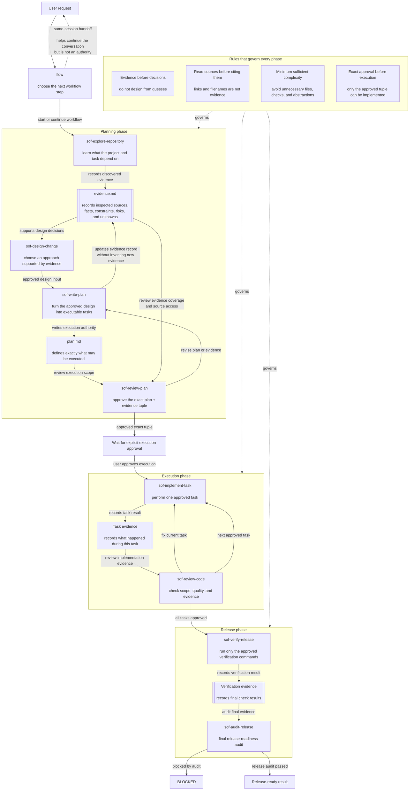

# OpenCode Flow Agents (sof CLI)

A small native OpenCode agent collection for evidence-based planning, gated implementation, independent review, and release audit, distributed via an npm CLI installer (`sof`).

**canonical source:** `agents/` at the repository root is the only tracked and package-shipped agent source. This is not an OpenCode plugin — it installs agents and patches configuration directly.

## Workflow



Planning produces two authoritative artifacts:

```text
.opencode/plans/YYYY-MM-DD-<slug>/
├── plan.md
└── evidence.md
```

## Core Invariants

- **Evidence before decision**: collect sufficient evidence before designing, planning, or implementing work that depends on external knowledge, data or interface structure, statistical or engineering assumptions, dependency behavior, or domain-specific methods.
- **Source access integrity**: a URL, citation, path, package, skill, or reference title is not evidence unless the relevant content was actually accessed and read.
- **Approval before execution**: implementation requires independent approval of the exact plan/evidence path, revision, and SHA-256 tuple.
- **Minimum sufficient complexity**: evidence, validation, artifacts, dependencies, abstractions, and review steps must be sufficient for the approved scope, not exhaustive by default.

## Agents

| Agent | Role |
| --- | --- |
| `flow` | Primary workflow router and gatekeeper |
| `sof-explore-repository` | Collect repository evidence |
| `sof-design-change` | Define design decisions and acceptance criteria |
| `sof-write-plan` | Create or revise `plan.md` and `evidence.md` |
| `sof-review-plan` | Independently review and approve exact plan/evidence revisions |
| `sof-implement-task` | Implement one approved task |
| `sof-review-code` | Review implementation against the approved plan |
| `sof-verify-release` | Run fresh release verification |
| `sof-audit-release` | Perform the final evidence-only release audit |

## Installation

### Primary: npm CLI installer

```bash
npm install -g simple-opencode-flow
sof install
```

This installs all agents to the current project's `.opencode/agents/` directory.

### Global installation

```bash
npm install -g simple-opencode-flow
sof install --global
```

Installs agents to `~/.config/opencode/agents/`.

### Project-specific installation

```bash
sof install --project /path/to/project
```

Installs agents to the specified project directory.

### Scope resolution

- `--project <path>`: uses the exact normalized directory
- Default (no `--project`, no `--global`): discovers the nearest Git root from the current working directory
- If no Git root is found, `sof install` fails with a clear error — it never silently falls back to the current working directory

### manual fallback installation

If the CLI installer is unavailable, you can manually copy agents from the package:

```bash
# Find the package location
npm root -g
# Copy agents to your project
cp -R $(npm root -g)/simple-opencode-flow/agents/*.md /path/to/project/.opencode/agents/
```

## CLI Commands

### `sof install`

Install agents to the target project or global scope.

```bash
sof install [--project <path> | --global] [--dry-run] [--force] [--migrate-legacy]
```

**Options:**
- `--project <path>`: install to specific project directory
- `--global`: install to `~/.config/opencode/agents/`
- `--dry-run`: preview what would be installed without making changes
- `--force`: overwrite existing agents (resolves ownership conflicts only)
- `--migrate-legacy`: detect and rename pre-sof agents by exact SHA-256 match

**Behavior:**
- Copies agents from package `agents/` to target with `sof-` prefix renaming
- Creates per-rule config ownership manifest (`.opencode/.sof-manifest.json`)
- Patches Build and Plan Task permissions to deny `sof-*` and `flow` agents
- Creates timestamped backups before any modifications

### `sof update`

Update installed agents and configuration.

```bash
sof update [--project <path> | --global] [--dry-run] [--force]
```

**Options:**
- `--project <path>`: update specific project
- `--global`: update global installation
- `--dry-run`: preview changes without applying
- `--force`: overwrite user-modified managed agents

**Behavior:**
- Compares current state against manifest's last-written state
- User-modified managed agents are reported as conflicts (require `--force`)
- Preserves user-added config fields
- Updates only installer-owned content

### `sof uninstall`

Remove installed agents and configuration.

```bash
sof uninstall [--project <path> | --global] [--dry-run] [--force]
```

**Options:**
- `--project <path>`: uninstall from specific project
- `--global`: uninstall global installation
- `--dry-run`: preview what would be removed
- `--force`: remove user-modified managed agents

**Behavior:**
- Removes managed agent files
- Removes only installer-owned config changes
- Restores original scalar Task policy only when exact match
- Preserves all user-added fields and content
- Creates backups before removal

### `sof doctor`

Diagnose installation state and protection levels.

```bash
sof doctor [--project <path> | --global] [--runtime]
```

**Options:**
- `--project <path>`: diagnose specific project
- `--global`: diagnose global installation
- `--runtime`: check runtime OpenCode protection (requires `opencode` binary)

**Three protection levels:**

1. **Selected-scope protection** (always checked): verifies that Build and Plan Task permissions in the project/global config deny `sof-*` and `flow` agents. This is the installer-managed protection.

2. **Plugin-free resolved protection** (default without `--runtime`): uses `opencode debug config --pure` to check the fully resolved config without plugins. Reports UNKNOWN if `opencode` is unavailable or output is unrecognized.

3. **Runtime protection** (`--runtime` only): checks actual runtime protection including plugins. Reports UNKNOWN when uncertain. **Note:** Runtime protection depends on OpenCode's plugin system and cannot be guaranteed by the installer alone.

**Important:** `sof doctor` reports protection status but does NOT claim unconditional global protection. Protection depends on:
- Correct config patching (installer-managed)
- OpenCode version compatibility
- Plugin system behavior (runtime only)

## Safety Model

### Backups

All operations create timestamped backups before modifying or deleting existing data. Backups are located in `.opencode/.sof-backups-<timestamp>/` within the project root.

### Atomic operations

File operations use atomic same-directory temp writes followed by rename, preventing partial writes on failure.

### Rollback

On caught errors during operations, the installer performs best-effort rollback:
- Restores backed-up files
- Deletes newly created files
- Reports rollback status

**Important:** Rollback only works for caught errors. If the process is terminated abnormally (e.g., kill -9, power loss), partial state may remain. Use `sof doctor` to detect inconsistencies and manually restore from backups.

### Manual restoration from backups

After abnormal termination, you can manually restore from backups:

```bash
# Find the latest backup directory
ls -la .opencode/.sof-backups-*

# Restore specific files
cp .opencode/.sof-backups-*/opencode.json .opencode/
cp .opencode/.sof-backups-*/agents/*.md .opencode/agents/
```

### Pre-validation

All parsing, validation, ownership checks, conflict detection, and operation planning complete before any write. `--dry-run` performs this pre-validation with zero writes.

## Build and Plan Task Protection

The installer patches OpenCode configuration to deny `sof-*` and `flow` agents in both Build and Plan Task permissions:

```jsonc
{
  "agent": {
    "build": {
      "permission": {
        "task": {
          "sof-*": "deny",
          "flow": "deny"
        }
      }
    },
    "plan": {
      "permission": {
        "task": {
          "sof-*": "deny",
          "flow": "deny"
        }
      }
    }
  }
}
```

This prevents workflow agents from being invoked during Build and Plan phases, ensuring they only run during their designated workflow stages.

**Position-aware enforcement:** If existing deny rules have the correct value but are not positioned last in the Task object (where last-match-wins applies), the installer moves them to the end to prevent potential overrides.

## Use

Select the `flow` primary agent in OpenCode, then describe the goal and constraints:

```text
Create a reviewed implementation plan for <goal>. Plan only; do not execute.
```

After `sof-review-plan` approves the exact plan/evidence tuple, explicitly authorize execution:

```text
Approve execution of the current approved plan.
```

Within the same session, `flow` distinguishes:

- **Continue current plan**: resume the approved execution.
- **Revise current plan**: update the same plan directory and review again.
- **Create follow-up plan**: create and independently approve a new plan.

`flow` never edits files or runs shell commands itself. Implementation does not commit, push, or publish unless the collection is intentionally modified to permit it.
