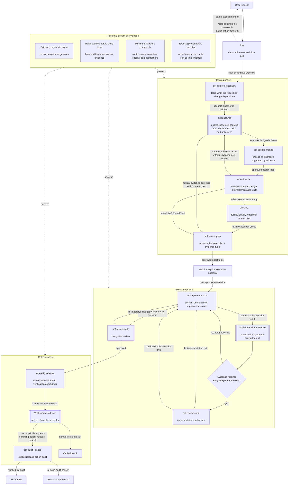

# Simple OpenCode Flow (SOF) Agents

A native OpenCode Markdown agent distribution for evidence-based planning, gated implementation, independent review, and release audit. Installed via `scripts/install.mjs` with zero external dependencies.

The canonical distribution source is the `agents/` directory in this repository. The `.opencode/` directory is a local OpenCode work directory, not the distribution source.

## Workflow



Planning produces two authoritative artifacts:

```text
.opencode/plans/YYYY-MM-DD-<slug>/
├── plan.md
└── evidence.md
```

## Core Invariants

- **Evidence before decision**: collect sufficient evidence before designing, planning, or implementing work that depends on external knowledge, data or interface structure, statistical or engineering assumptions, dependency behavior, or domain-specific methods.
- **Source access integrity**: a URL, citation, path, package, skill, or reference title is not evidence unless the relevant content was actually accessed and read.
- **Approval before execution**: implementation requires independent approval of the exact plan/evidence path, revision, and SHA-256 tuple.
- **Minimum sufficient complexity**: evidence, validation, artifacts, dependencies, abstractions, and review steps must be sufficient for the approved scope, not exhaustive by default.
- **User-locked mechanisms and artifacts**: when the user explicitly names a delivery mechanism or artifact, agents preserve it as a locked constraint. Infeasible choices block with an explanation; potentially better alternatives are presented for user decision and are never adopted silently.
- **On-demand external context**: agents load skills and authoritative web sources only to resolve a concrete, material information or evidence gap, not routinely or for completeness.
- **Evidence-driven review routing**: repository exploration records risks and dependencies; Flow uses that evidence to require early review only for implementation units that need it, while integrated review always covers the complete change.
- **Relevant self-contained handoffs**: each subagent invocation receives every input required by its gate, while recoverable authoritative content is referenced rather than copied and unrelated historical output is omitted.

## Terminology

- **Subagent invocation**: one focused-agent call made by `flow`.
- **Planning gate**: repository exploration, design, plan writing, or plan review.
- **Implementation unit**: one executable item in the approved `plan.md`.
- **Implementation-unit review**: early independent code review of one completed implementation unit when evidence requires it.
- **Integrated review**: independent review of the complete implemented change after all implementation units finish.

## Agents

| Agent | Role |
| --- | --- |
| `flow` | Primary workflow router and gatekeeper |
| `sof-explore-repository` | Collect repository evidence |
| `sof-design-change` | Define design decisions and acceptance criteria |
| `sof-write-plan` | Create or revise `plan.md` and `evidence.md` |
| `sof-review-plan` | Independently review and approve exact plan/evidence revisions |
| `sof-implement-task` | Implement one approved implementation unit |
| `sof-review-code` | Perform implementation-unit or integrated review |
| `sof-verify-release` | Run fresh release verification |
| `sof-audit-release` | Audit evidence only for an explicitly requested release action |

## Install

Install agents using the zero-dependency `scripts/install.mjs` installer:

```bash
# Project-level install (copies agents to .opencode/agents/)
node scripts/install.mjs --scope project

# Global install (copies agents to ~/.config/opencode/agents/)
node scripts/install.mjs --scope global

# Dry-run (preview without changes)
node scripts/install.mjs --dry-run

# Custom directory install (copies agents to specified path)
node scripts/install.mjs --target ./my-agents
```

The installer:
- Copies all agent `.md` files from `agents/` to the target directory
- Patches `opencode.json` with required permission deny entries (project scope only)
- Detects JSONC configuration and exits with error (JSONC is not supported)
- Preserves existing files in the target directory

### Manual Installation

If you cannot or prefer not to run the installer script:

1. **Copy agent files** from `agents/` to your OpenCode agents directory:
   - **Project-level:** `<project>/.opencode/agents/`
   - **Global:** `~/.config/opencode/agents/`
   - **Custom:** any directory of your choice

2. **(Optional) Configure deny entries** in your project's `opencode.json`:
   ```json
   {
     "agent": {
       "build": {
         "permission": {
           "task": {
             "sof-*": "deny",
             "flow": "deny"
           }
         }
       },
       "plan": {
         "permission": {
           "task": {
             "sof-*": "deny",
             "flow": "deny"
           }
         }
       }
     }
   }
   ```
   Skip this step if you don't have an `opencode.json` yet. Create one first if needed.

**Note**: The `agents/` directory in this repository is the canonical distribution source. The `.opencode/` directory is a local OpenCode work directory and should not be used for distribution.

## Use

Select the `flow` primary agent in OpenCode, then describe the goal and constraints:

```text
Create a reviewed implementation plan for <goal>. Plan only; do not execute.
```

After `sof-review-plan` approves the exact plan/evidence tuple, explicitly authorize execution:

```text
Approve execution of the current approved plan.
```

Within the same session, `flow` distinguishes:

- **Continue current plan**: resume the approved execution.
- **Revise current plan**: update the same plan directory and review again.
- **Create follow-up plan**: create and independently approve a new plan.

`flow` never edits files or runs shell commands itself. Implementation does not commit, push, or publish unless the collection is intentionally modified to permit it.
