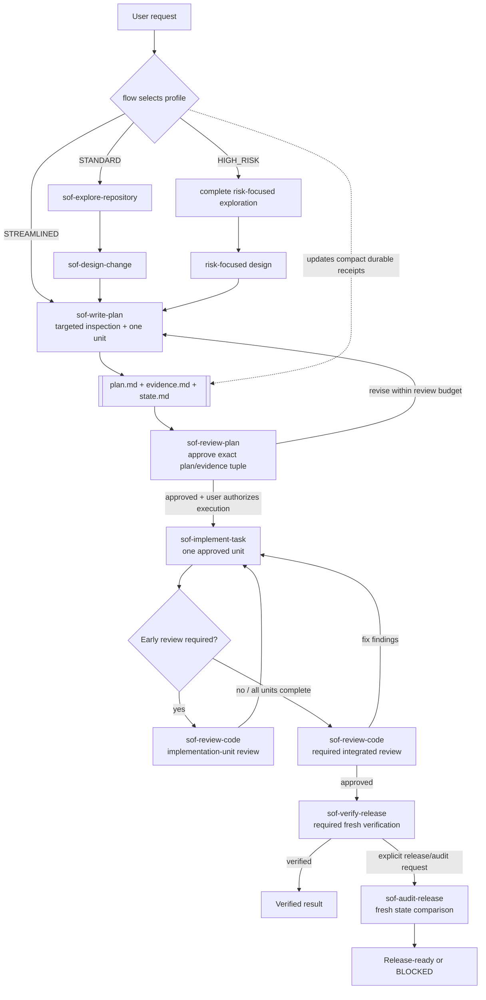

# Simple OpenCode Flow (SOF) Agents

A native OpenCode Markdown agent distribution for evidence-based planning, gated implementation, independent review, and release audit. Installed via `scripts/install.mjs` with zero external dependencies.

The canonical distribution source is the `agents/` directory in this repository. The `.opencode/` directory is a local OpenCode work directory, not the distribution source.

## Workflow



Every plan directory contains two authoritative artifacts and one compact workflow-state artifact:

```text
.opencode/plans/YYYY-MM-DD-<slug>/
├── plan.md
├── evidence.md
└── state.md
```

- `plan.md` and its revision are the sole execution authority.
- `evidence.md` is the repository-evidence and Source Access Integrity authority.
- `state.md` records the workflow profile, current phase, approval/review/verification receipts, blocker, and next gate. It is not execution or evidence authority and is not part of the plan/evidence approval hash tuple.
- Flow's expected updates to the active `state.md` are excluded from implementation-scope and post-verification comparisons only for that exact workflow-metadata file; every other unexplained change still blocks.

## Workflow Profiles

| Profile | Use when | Planning route | Early implementation-unit review |
| --- | --- | --- | --- |
| `STREAMLINED` | One clear low-risk unit with known scope and no material unknowns or shared/high-risk behavior | `sof-write-plan` performs targeted inspection, then independent plan review | None; integrated review is still required |
| `STANDARD` | Normal changes that do not qualify as Streamlined or High Risk | Repository exploration, design, plan writing, and plan review | Required only when evidence or dependencies justify it |
| `HIGH_RISK` | Security, privacy, permissions, migrations, irreversible operations, public/shared contracts, dependencies, data formats, or material unknowns | Complete risk-focused planning route | Required for every risk-related or dependency-foundational unit |

When Streamlined planning discovers ambiguity or risk, it escalates before creating artifacts. Independent plan review, integrated code review, and release verification are mandatory for every profile.

If execution reveals facts that invalidate the current profile, Flow stops execution, revises the profile in all three artifacts, and requires a new plan/evidence approval tuple before continuing.

## Core Invariants

- **Evidence before decision**: collect sufficient evidence before designing, planning, or implementing work that depends on external knowledge, data or interface structure, statistical or engineering assumptions, dependency behavior, or domain-specific methods.
- **Source access integrity**: a URL, citation, path, package, skill, or reference title is not evidence unless the relevant content was actually accessed and read.
- **Approval before execution**: implementation requires independent approval of the exact plan/evidence path, revision, and SHA-256 tuple.
- **Minimum sufficient complexity**: evidence, validation, artifacts, dependencies, abstractions, and review steps must be sufficient for the approved scope, not exhaustive by default.
- **Durable compact receipts**: Flow persists only downstream-required workflow state in sibling `state.md`; recoverable artifact content and historical transcripts are not copied into handoffs.
- **Bounded automatic review**: each plan-review loop allows three attempts, and material-basis restarts still count toward a maximum of five automatic plan-review calls per user-authorized review cycle.
- **User-locked mechanisms and artifacts**: when the user explicitly names a delivery mechanism or artifact, agents preserve it as a locked constraint. Infeasible choices block with an explanation; potentially better alternatives are presented for user decision and are never adopted silently.
- **On-demand external context**: agents load skills and authoritative web sources only to resolve a concrete, material information or evidence gap, not routinely or for completeness.
- **Independent repository-state review**: code review and release audit use read-only Git commands to establish actual scope instead of trusting implementer reports alone.

## Terminology

- **Subagent invocation**: one focused-agent call made by `flow`.
- **Implementation unit**: one executable item in the approved `plan.md`.
- **Implementation-unit review**: early independent code review of one completed implementation unit when evidence requires it.
- **Integrated review**: independent review of the complete implemented change after all implementation units finish.
- **Review cycle**: a user-authorized automatic plan-review budget containing at most five review calls.
- **Trusted executor**: an agent with broad capabilities whose authorization remains limited by the approved plan and behavioral contract.

## Agents

| Agent | Role |
| --- | --- |
| `flow` | Select the workflow profile, route gates, and maintain compact `state.md` receipts |
| `sof-explore-repository` | Collect compact repository evidence for Standard and High Risk planning |
| `sof-design-change` | Define the smallest evidence-backed Standard or High Risk design |
| `sof-write-plan` | Create or revise planning artifacts and initialize `state.md` |
| `sof-review-plan` | Independently review and approve exact plan/evidence revisions |
| `sof-implement-task` | Trusted Build-level executor for one approved implementation unit |
| `sof-review-code` | Independently inspect actual repository changes and perform unit or integrated review |
| `sof-verify-release` | Trusted verification executor that runs only approved release commands |
| `sof-audit-release` | Audit an explicit release action using receipts and fresh repository state |

## Install

Install agents using the zero-dependency `scripts/install.mjs` installer:

```bash
# Project-level install (copies agents to .opencode/agents/)
node scripts/install.mjs --scope project

# Global install (copies agents to ~/.config/opencode/agents/)
node scripts/install.mjs --scope global

# Dry-run (preview without changes)
node scripts/install.mjs --dry-run

# Custom directory install (copies agents to specified path)
node scripts/install.mjs --target ./my-agents
```

The installer:
- Copies all agent `.md` files from `agents/` to the target directory
- Patches `opencode.json` with required permission deny entries (project scope only)
- Detects JSONC configuration and exits with error (JSONC is not supported)
- Preserves existing files in the target directory

### Manual Installation

If you cannot or prefer not to run the installer script:

1. **Copy agent files** from `agents/` to your OpenCode agents directory:
   - **Project-level:** `<project>/.opencode/agents/`
   - **Global:** `~/.config/opencode/agents/`
   - **Custom:** any directory of your choice

2. **(Optional) Configure deny entries** in your project's `opencode.json`:
   ```json
   {
     "agent": {
       "build": {
         "permission": {
           "task": {
             "sof-*": "deny",
             "flow": "deny"
           }
         }
       },
       "plan": {
         "permission": {
           "task": {
             "sof-*": "deny",
             "flow": "deny"
           }
         }
       }
     }
   }
   ```
   Skip this step if you don't have an `opencode.json` yet. Create one first if needed.

**Note**: The `agents/` directory in this repository is the canonical distribution source. The `.opencode/` directory is a local OpenCode work directory and should not be used for distribution.

## Use

Select the `flow` primary agent in OpenCode, then describe the goal and constraints:

```text
Create a reviewed implementation plan for <goal>. Plan only; do not execute.
```

After `sof-review-plan` approves the exact plan/evidence tuple, explicitly authorize execution:

```text
Approve execution of the current approved plan.
```

Within the same session, `flow` distinguishes:

- **Continue current plan**: resume the approved execution.
- **Revise current plan**: update the same plan directory and review again.
- **Create follow-up plan**: create and independently approve a new plan.

Flow automatically selects `STREAMLINED`, `STANDARD`, or `HIGH_RISK`, records the choice in `state.md`, and restores interrupted workflows from the three sibling artifacts. It edits only the active plan's `state.md` and never runs shell commands.

`sof-implement-task` and `sof-verify-release` intentionally have broad Build-level and verification capabilities, respectively. Their approved contracts limit what they may do. No custom agent commits, pushes, publishes, or performs a release action.
