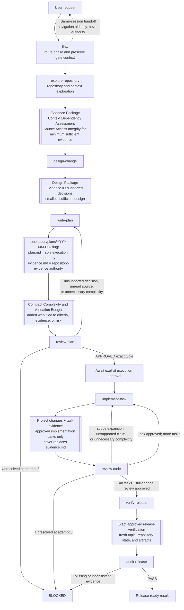

# OpenCode Flow Agents

A small native OpenCode agent collection for evidence-based planning, gated implementation, independent review, and release audit.

The agents live in `.opencode/agents/`, the native project-local OpenCode agent directory. No plugin or external runtime is required.

## Workflow



Planning produces two authoritative artifacts:

```text
.opencode/plans/YYYY-MM-DD-<slug>/
├── plan.md
└── evidence.md
```

## Core Invariants

- **Evidence before decision**: collect sufficient evidence before designing, planning, or implementing work that depends on external knowledge, data or interface structure, statistical or engineering assumptions, dependency behavior, or domain-specific methods.
- **Source access integrity**: a URL, citation, path, package, skill, or reference title is not evidence unless the relevant content was actually accessed and read.
- **Approval before execution**: implementation requires independent approval of the exact plan/evidence path, revision, and SHA-256 tuple.
- **Minimum sufficient complexity**: evidence, validation, artifacts, dependencies, abstractions, and review steps must be sufficient for the approved scope, not exhaustive by default.

## Agents

| Agent | Role |
| --- | --- |
| `flow` | Primary workflow router and gatekeeper |
| `explore-repository` | Collect repository evidence |
| `design-change` | Define design decisions and acceptance criteria |
| `write-plan` | Create or revise `plan.md` and `evidence.md` |
| `review-plan` | Independently review and approve exact plan/evidence revisions |
| `implement-task` | Implement one approved task |
| `review-code` | Review implementation against the approved plan |
| `verify-release` | Run fresh release verification |
| `audit-release` | Perform the final evidence-only release audit |

## Install

Copy `.opencode/agents/` into the root of the target repository:

```bash
mkdir -p /path/to/project/.opencode
cp -R .opencode/agents /path/to/project/.opencode/
```

Verify discovery:

```bash
cd /path/to/project
opencode agent list --pure
```

## Use

Select the `flow` primary agent in OpenCode, then describe the goal and constraints:

```text
Create a reviewed implementation plan for <goal>. Plan only; do not execute.
```

After `review-plan` approves the exact plan/evidence tuple, explicitly authorize execution:

```text
Approve execution of the current approved plan.
```

Within the same session, `flow` distinguishes:

- **Continue current plan**: resume the approved execution.
- **Revise current plan**: update the same plan directory and review again.
- **Create follow-up plan**: create and independently approve a new plan.

`flow` never edits files or runs shell commands itself. Implementation does not commit, push, or publish unless the collection is intentionally modified to permit it.
